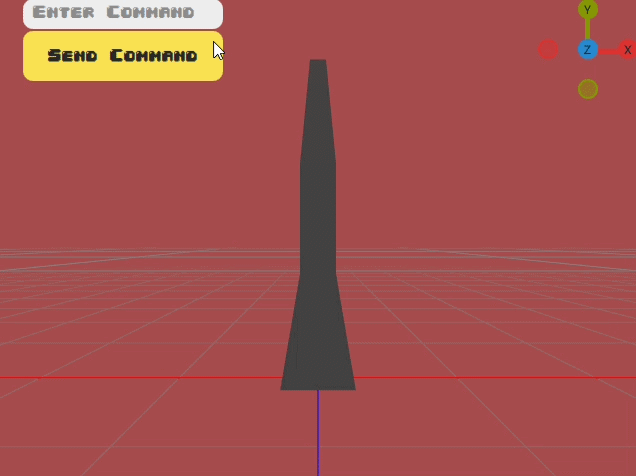

# RemoteArm
<div align="center">
  
</div>

## 🚀 Project Description
Remote control system for a robotic arm using an ESP32 via WiFi.
## Workflow
You sent commands from the client "SET M 45" and the ESP32 server will make something with it, in this case: move a servo located in the mid part of the bone hierarchy 45 degrees.
- This actually works on a ESP32? yes, you can look at the firmware folder for the code, It works on mine. Change the ESP32Actuator for the actual functions(In this case I only use Serial.print for example)
- What about the 3D visualization? is an 3D model made in blender(yes really simple)working on a QT app for realtime visualization of the real hardware working. But in this case it was just for testing commands.

## 📋 Prerequisites
- 💡 Being alive (optional)
- ✨ See the README of each folder for Requisites. 

## 🛠️ Quick Start
```bash
# 1. Clone repository
git clone https://github.com/GizzlyFacu/RemoteArm.git
# 2. View module-specific setup
- Firmware: view /firmware/README.md
- Client: view /client/README.md
- Server: view /server/README.md
```
